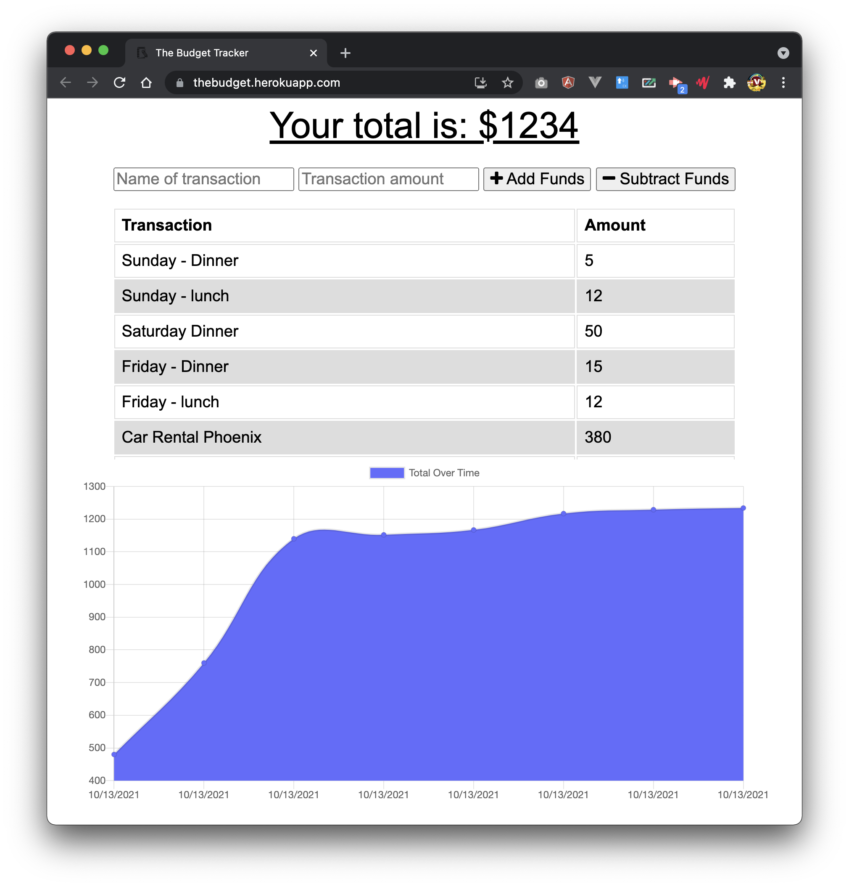

# The Budget

 

 

## Description

_The objective of this project:_

The budget is an application to help me track my expenses when I am out traveling. It is nice to have for any ocassion. This keeps me from spending more than I have to with the hopes I come back feeling good about myself and not worring about how much I spent.

This app is available on Heroku:
[The Budget on Heroku](https://thebudget.herokuapp.com/)

 ## Table of contents

- [Installation](#installation)
- [Usage](#usage)
- [Contributing](#contributing)
- [Tests](#testing)
- [Questions](#questions)

## Installation

Download a copy of this repository and once you have it downloaded, you have to run the script `npm run install` then, run the following code `npm run start`.

## Usage

_Instructions and examples for use:_
The beauty of this app is, the portability. What I mean about portability? This is develop as a downloadable application that can be used even when you are not connected to the internet. So, it works anywhere!

## contributing

_If you would like to contribute it, you can follow these guidelines for how to do so._
Please download or fork the repository and submit it for my approval.

## Testing

\*Please follow these directions to test the app.
there are no tests in this build.

## Questions

_If you have a concern or input abou the project, you can contact:_
 
Please contact Javier Vilchis via [Email](Javivilchis@gmail.com)
